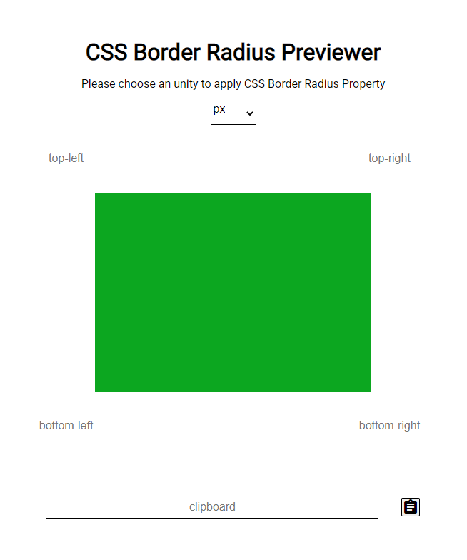

<h1 align="center">
  Border Radius Previewer
</h1>

## Tecnologias

Esse projeto foi desenvolvido com as seguintes tecnologias:

- HTML
- CSS
- JavaScript

## Projeto

O Border Radius Previwer é um projeto inspirado na App Idea [Border-radius Previewer](https://github.com/florinpop17/app-ideas/blob/master/Projects/1-Beginner/Border-Radius-Previewer.md) por [florinpop17](https://github.com/florinpop17). Basicamente é um visualizador para a propriedade <code>border-radius</code> do CSS3, com a possibilidade de copiar o código produzido ao final da visualização.

## Layout

Esse é o layout do projeto.
 
 

## Acesso

O projeto pode ser acessado e testado [aqui](https://gabrielpdb.github.io/border-radius-previewer/)

Made by [GabrielPDB](https://github.com/GabrielPDB)
